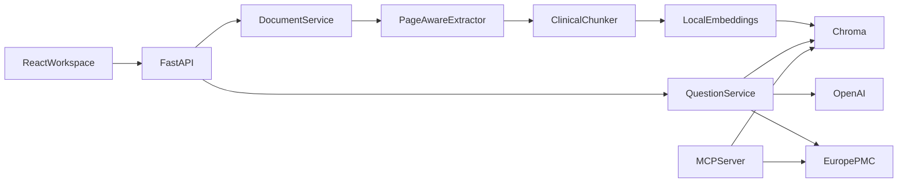

# Medical Document Assistant

Drop in a protocol, Word file, or even a scanned page. Ask a question. The
answer points back to the page it came from.

Everything is indexed on your machine. If the sources don't support a claim, it
just says so.

> Research use only — not medical advice. Check the original file.

## On a Mac

You need Python 3.12, [uv](https://docs.astral.sh/uv/), Node 20+, and an
[OpenAI API key](https://platform.openai.com/api-keys).

```bash
cp .env.example .env
```

Put the key in `.env`, then start the API:

```bash
uv sync
uv run medical-document-api
```

That's `http://127.0.0.1:8000` (docs at `/api/docs`). In another terminal:

```bash
cd frontend
npm install
npm run dev
```

Open [http://localhost:5173](http://localhost:5173), drop a file from
`demo_documents/`, and ask something like:

```text
What primary endpoint was reported?
```

The first upload pulls the local embedding model into your Hugging Face cache.
Scanned pages go through free on-device OCR, so you don't need a cloud OCR key.

### Windows

Same steps, slightly different shell:

```powershell
Copy-Item .env.example .env
uv sync
uv run medical-document-api
```

```powershell
cd frontend
npm install
npm run dev
```

Linux works the same way as Mac.

## What you can upload

PDF, Word (`.docx`, and `.doc` when macOS `textutil` or LibreOffice can read
it), ODT, RTF, HTML, Markdown, plain text, and images (PNG, JPEG, TIFF, WebP).
Scanned PDFs and photos are OCRed locally with RapidOCR.

Pick the files you want to ask about. Optional: fold in Europe PMC abstracts.

## Config

Copy `.env.example` to `.env`. The ones that matter:

| Variable | Default | What it does |
| --- | --- | --- |
| `OPENAI_API_KEY` | empty | Needed for answers |
| `APP_OPENAI_MODEL` | `gpt-5-mini` | Generation model |
| `APP_API_KEY` | empty | If set, send it as `X-API-Key` |
| `APP_ALLOWED_ORIGINS` | Vite localhost | CORS |
| `APP_MAX_UPLOAD_MB` | `20` | Upload cap |
| `APP_EMBEDDING_MODEL` | `sentence-transformers/all-MiniLM-L6-v2` | Local embeddings |
| `APP_TOP_K` | `8` | Passages per question |

Frontend, if you want it (`frontend/.env`):

```text
VITE_API_BASE_URL=http://localhost:8000
VITE_API_KEY=
```

Don't treat `VITE_API_KEY` as a real secret. It ends up in the browser bundle.

## How answers stay grounded

The question is embedded, nearby passages are stuffed into a tight prompt, and
the model has to cite every medical claim. Made-up citations get replaced with:

```text
Not found in the documents.
```

Local citations look like `[doc:<id> p.<page>]`. Literature looks like
`[PMID:<id>]` or `[EPMC:<source>:<id>]`.

## Architecture



```text
src/pharm_assistant/   API, services, MCP
frontend/              React workspace
prompts/               answer template
demo_documents/        fictional samples
tests/                 unit and API tests
evals/                 retrieval cases
```

## HTTP API

| Method | Path | Description |
| --- | --- | --- |
| `GET` | `/health` | Models, index, document count |
| `GET` | `/api/v1/documents` | List files |
| `POST` | `/api/v1/documents` | Upload and index |
| `GET` | `/api/v1/documents/{id}/file` | Open the stored file |
| `GET` | `/api/v1/documents/{id}/pages/{n}` | Page preview (PDF / image) |
| `DELETE` | `/api/v1/documents/{id}` | Remove file and chunks |
| `POST` | `/api/v1/questions` | Retrieve and answer |

Upload and ask:

```bash
curl -X POST http://127.0.0.1:8000/api/v1/documents \
  -F "file=@demo_documents/synthetic_clinical_trial_summary.pdf;type=application/pdf"

curl -X POST http://127.0.0.1:8000/api/v1/questions \
  -H "Content-Type: application/json" \
  -d '{"question":"What primary endpoint was reported?","document_ids":["DOCUMENT_ID"],"top_k":8,"include_literature":false}'
```

On Windows, `curl.exe` is the same idea. If `APP_API_KEY` is set, add `X-API-Key`.

## MCP

```bash
uv run medical-document-mcp
```

`search_documents` and `search_literature` are the two tools. Same pair is also
available as LangChain tools.

## Demo files

`demo_documents/` has a few small fictional PDFs. To rebuild them:

```bash
uv run python scripts/generate_demo_documents.py
```

Official references for local testing (gitignored under `.data/demo_documents/`):

```bash
uv run python scripts/fetch_demo_documents.py
```

## Docker

```bash
docker compose up --build
```

API on port 8000, data in `.data`. If you expose it, set `APP_ENV=production`, a
real `APP_API_KEY`, and an explicit origin list.

## Tests

```bash
uv run ruff check src tests scripts
uv run pytest
uv run python scripts/evaluate.py
cd frontend && npm run lint && npm run build
```

On Windows, `cd frontend; npm run lint; npm run build`.
