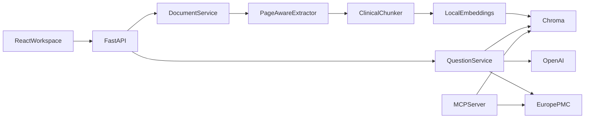

# Medical Document Assistant

Ask questions about medical PDFs and get answers that cite the exact page they
came from.

Upload a protocol, monograph, SOP, or trial summary. The app extracts the text,
indexes it locally, and answers only from the retrieved passages. If the sources
do not support a claim, it says so.

> Research and informational use only. Not medical advice. Always check the
> original document.

## What you can do

1. Drop one or more text-based PDFs into the source library.
2. Select which documents the question should use.
3. Ask a question in the workspace.
4. Open the cited page and excerpt in the evidence panel.

Optional: include Europe PMC abstracts alongside your own files.

## Requirements

- Windows, macOS, or Linux
- Python 3.12
- [uv](https://docs.astral.sh/uv/)
- Node.js 20 or newer
- An [OpenAI API key](https://platform.openai.com/api-keys)

## Run it locally

### 1. Backend

```powershell
Copy-Item .env.example .env
```

Set `OPENAI_API_KEY` in `.env`, then:

```powershell
uv sync
uv run medical-document-api
```

The API listens on `http://127.0.0.1:8000`. Docs: `http://127.0.0.1:8000/api/docs`.

The first upload downloads the embedding model `all-MiniLM-L6-v2` into the local
Hugging Face cache.

### 2. Frontend

```powershell
Set-Location frontend
npm install
npm run dev
```

Open `http://localhost:5173`.

### 3. Ask a question

Use a file from `demo_documents/` or one of your own:

- `synthetic_clinical_trial_summary.pdf`
- `synthetic_medication_monograph.pdf`
- `synthetic_safety_reporting_sop.pdf`

In the left panel, drop the PDF. In the center panel, ask something the document
can answer, for example:

```text
What primary endpoint was reported?
```

The answer includes inline citations. Click a citation to jump to the page
preview and excerpt.

## Configuration

Copy `.env.example` to `.env`. The main settings:

| Variable | Default | Purpose |
| --- | --- | --- |
| `OPENAI_API_KEY` | empty | Required for answers |
| `APP_OPENAI_MODEL` | `gpt-5-mini` | Generation model |
| `APP_API_KEY` | empty | If set, required on `/api/v1` as `X-API-Key` |
| `APP_ALLOWED_ORIGINS` | Vite localhost ports | CORS allow-list |
| `APP_MAX_UPLOAD_MB` | `20` | Upload size limit |
| `APP_EMBEDDING_MODEL` | `sentence-transformers/all-MiniLM-L6-v2` | Local embeddings |
| `APP_CHUNK_SIZE_WORDS` | `240` | Chunk size |
| `APP_TOP_K` | `8` | Retrieved passages per question |
| `APP_LANGFUSE_ENABLED` | `false` | Optional tracing |

Frontend (optional, in `frontend/.env`):

```text
VITE_API_BASE_URL=http://localhost:8000
VITE_API_KEY=
```

`VITE_API_KEY` is compiled into the browser bundle. Do not treat it as a
production secret.

## How answers are grounded

1. The question is embedded and compared to stored chunks.
2. The top matching passages are placed in a delimited prompt.
3. The model may use only that evidence and must cite every medical claim.
4. Invented or missing citations are rejected and replaced with:

```text
Not found in the documents.
```

Local citations look like `[doc:<id> p.<page>]`. Literature citations look like
`[PMID:<id>]` or `[EPMC:<source>:<id>]`. The API also returns structured
citation objects so the UI does not have to parse the answer text.

## Architecture



```text
src/pharm_assistant/   API, services, config, MCP server
frontend/              React workspace
prompts/               grounded-answer template
demo_documents/        fictional sample PDFs
tests/                 unit and API tests
evals/                 retrieval cases
scripts/               demo PDFs and evaluation
```

## HTTP API

| Method | Path | Description |
| --- | --- | --- |
| `GET` | `/health` | Models, index, and document count |
| `GET` | `/api/v1/documents` | List indexed PDFs |
| `POST` | `/api/v1/documents` | Upload and index one PDF |
| `GET` | `/api/v1/documents/{id}/file` | Open the stored PDF |
| `GET` | `/api/v1/documents/{id}/pages/{n}` | Preview one page as PNG |
| `DELETE` | `/api/v1/documents/{id}` | Remove the PDF and its chunks |
| `POST` | `/api/v1/questions` | Retrieve evidence and answer |
| `POST` | `/api/v1/questions/stream` | Same answer as SSE tokens |

Upload:

```powershell
curl.exe -X POST http://127.0.0.1:8000/api/v1/documents `
  -F "file=@demo_documents/synthetic_clinical_trial_summary.pdf;type=application/pdf"
```

Ask:

```powershell
curl.exe -X POST http://127.0.0.1:8000/api/v1/questions `
  -H "Content-Type: application/json" `
  -d "{\"question\":\"What primary endpoint was reported?\",\"document_ids\":[\"DOCUMENT_ID\"],\"top_k\":8,\"include_literature\":false}"
```

If `APP_API_KEY` is set, send `X-API-Key` on every `/api/v1` request.

## MCP

```powershell
uv run medical-document-mcp
```

- `search_documents(query, top_k, document_ids)` — page-aware chunks and scores
- `search_literature(query, max_results)` — Europe PMC abstracts and source IDs

The same functions are also available as LangChain tools:
`search_medical_documents` and `search_external_literature`.

## Demo documents

`demo_documents/` contains three small fictional PDFs with no PHI. Regenerate
them with:

```powershell
uv run python scripts/generate_demo_documents.py
```

To download official references for local testing only:

```powershell
uv run python scripts/fetch_demo_documents.py
```

Those files go under `.data/demo_documents/` (gitignored). Current sources are
WHO *Medication Safety in High-risk Situations* (CC BY-NC-SA 3.0 IGO) and an
NIH clinical-study operations guide. They are not redistributed in this repo.

## Docker

```powershell
docker compose up --build
```

The API is published on port 8000 with a persistent `.data` volume. Set
`APP_ENV=production`, a strong `APP_API_KEY`, and an explicit origin list before
exposing it beyond localhost.

In production the app requires `APP_API_KEY`, rejects wildcard CORS, hides
OpenAPI docs, and rate-limits upload and question routes.

## Tests

```powershell
uv run ruff check src tests scripts
uv run pytest
uv run python scripts/evaluate.py
```

`scripts/evaluate.py` indexes a synthetic handbook and reports page-level
retrieval hit rate. It does not call OpenAI.

To see how the model actually answers, cite, and refuse missing facts:

```powershell
uv run python scripts/evaluate.py --generation
uv run pytest -m live_openai
```

`--generation` uses the committed demo PDFs and `evals/generation_cases.json`.
Each case checks the exact fallback, required phrases, citation markers, and
cited page. Add `--judge` to have the model grade groundedness, or
`--strict-judge` to fail a case when that grade is false.

```powershell
Set-Location frontend
npm run lint
npm run build
```

## Privacy and licensing

- Uploads, vectors, and literature cache stay in `.data/` and are gitignored.
- Logs record request IDs, latency, chunk IDs, and token counts, not questions
  or document text.
- Asking a question sends the question and retrieved excerpts to OpenAI with
  `store=False`. Do not upload PHI to an unapproved account.
- PyMuPDF (used by `pymupdf4llm`) is AGPL-3.0 or commercially licensed.

## Limits

- Text-based PDFs only. Scanned files need OCR.
- Dense retrieval only.
- Europe PMC returns abstracts and metadata, not full text.
- No accounts, tenants, or clinical decision support.
- Not validated for GxP or clinical use.
